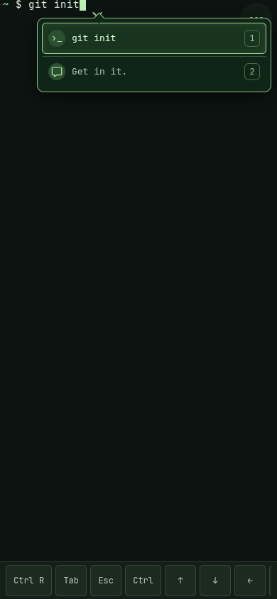
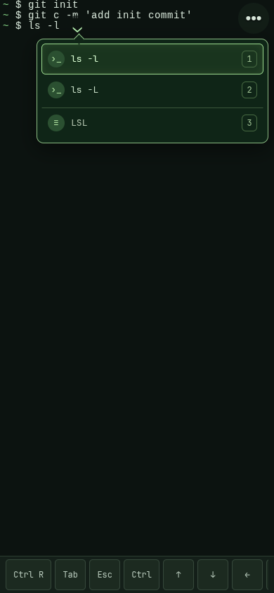
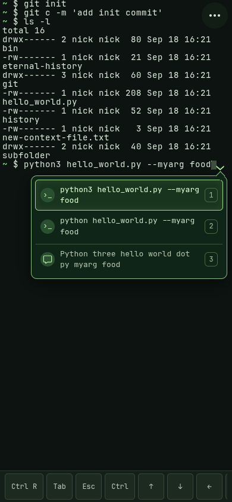

# termai

A mobile terminal that Just Works.

Run on your machine, serve via Tailscale, dictate input.

<p>
  
  
  
</p>

## Build and run

On the Linux machine you want to control, install **Node.js 22.18+**, **Bash**, **Python 3**, and `base64`/`tr`.
If `node-pty` has no usable prebuilt binary for your platform, you also need a C++ build toolchain.

From your checkout:

```sh
npm ci
npm run build
npm start
```

Open **http://127.0.0.1:3000** to try it locally.
The shell starts in the checkout directory; set `TERMAI_CWD=/absolute/path/to/project` to choose another directory.
For development, use `npm run dev`.

The interface uses bundled JetBrains Mono. Open **Settings** (•••) to change the
terminal font size from 10–32 px (default 14 px). Changes apply immediately and
are saved in this browser.

## Connect from your phone with Tailscale

1. Install and sign in to Tailscale on both the host and your phone, using the same tailnet.
   Find the host’s full DNS name in Tailscale (for example, `my-machine.tail1234.ts.net`).
2. Stop the local server if it is running, then start it with your hostname and preferred working directory:

   ```sh
   HOST=127.0.0.1 PORT=7321 TERMAI_ALLOWED_HOSTS=my-machine.tail1234.ts.net TERMAI_BASE_PATH=/t TERMAI_CWD=/absolute/path/to/project npm start
   ```

3. In another terminal on the host, configure [Tailscale Serve](https://tailscale.com/docs/reference/tailscale-cli/serve):

   ```sh
   tailscale serve --bg --set-path=/termai http://127.0.0.1:7321
   ```

   Follow any prompt to enable HTTPS for your tailnet.
4. With Tailscale connected on your phone, open https://my-machine.tail1234.ts.net/termai.
   Optionally add it to your home screen.

Keep the server running; for automatic startup, run the same command and environment under a user service or your process manager.
Tailscale’s `--bg` keeps the proxy configuration active, but does not start termai itself.

This setup relies on tailnet access controls: anyone allowed to reach this endpoint can run commands as your host user.
For an additional connection token, set `TERMAI_TOKEN` to a random value of at least 24 characters and enter it in the app.

## Dictation

Recommended, in order of quality:
- **[Aqua Voice](https://aquavoice.com)** for iPhone (soon Android!),
- **[Wispr Flow](https://wisprflow.ai)** for Android or iPhone,
- Your mobile's built-in dictation.

These tools supply text; termai repairs it using your shell’s context.

## License and acknowledgments

termai is licensed under the [MIT License](LICENSE).

Terminal rendering uses [ghostty-web](https://github.com/coder/ghostty-web) by
Coder, which embeds [Ghostty / libghostty](https://github.com/ghostty-org/ghostty)
by Mitchell Hashimoto and the Ghostty contributors as WebAssembly. Both are
MIT-licensed; their copyright notices and full license texts are preserved in
[THIRD-PARTY-NOTICES.txt](public/THIRD-PARTY-NOTICES.txt).
The bundled [JetBrains Mono](https://github.com/JetBrains/JetBrainsMono) font is
licensed under the SIL Open Font License 1.1, also reproduced in that notice.
Vite copies this notice into `dist/` for production distribution. Keep it with
the bundled JavaScript and WebAssembly when redistributing the build, and review
the notices when updating ghostty-web or its embedded Ghostty revision.
