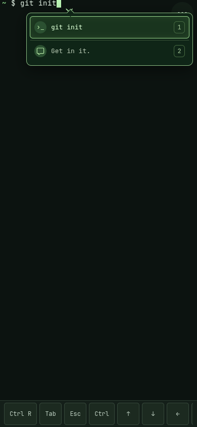
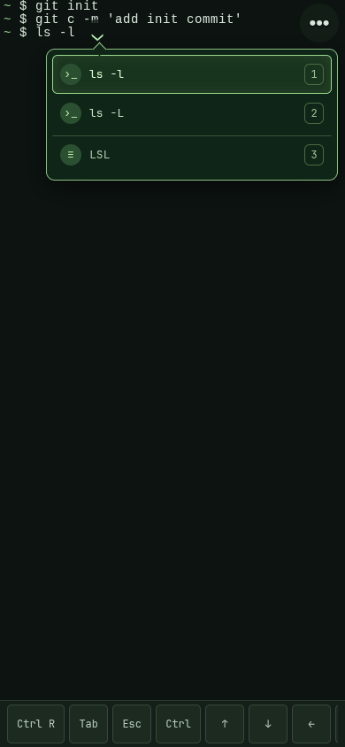
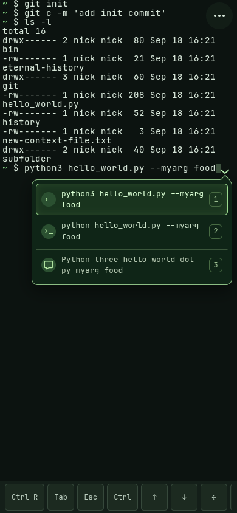

# termai

A mobile terminal that Just Works.

Command repair uses one [shared engine](docs/shared-engine.md), running on the
server by default. Set `TERMAI_ENGINE=client` to run it in a browser worker instead.
Both modes use the same frontend and matching logic.

Run on your machine, serve via Tailscale, dictate input.

<p>
  
  
  
</p>

## Build and run

On the Linux machine you want to control, install **Node.js 22.18+**, **Bash**, **Python 3**, and `base64`.
If `node-pty` has no usable prebuilt binary for your platform, you also need a C++ build toolchain.

From your checkout:

```sh
npm ci
npm run build
npm start
```

Open **http://127.0.0.1:3000** and enter the **pairing token** printed at server startup.
Every frontend must pair, including browsers on the original host.
The server generates a token and saves it in `$TERMAI_DATA_DIR/pairing-token`
(default `~/.local/share/termai/pairing-token`, readable only by your user).
It reuses this token after restarts. To supply your own, set `TERMAI_TOKEN` to a
random value of at least 24 characters. Empty or unset values generate a token;
they never disable pairing.
The shell starts in the checkout directory; set `TERMAI_CWD=/absolute/path/to/project` to choose another directory.
For development, use `npm run dev`.
Development also requires pairing before serving source files or enabling hot reload.
See the [pairing security review](docs/pairing-security.md) for tested boundaries and limitations.

The interface uses bundled JetBrains Mono. Open the **Settings** tab to change the
terminal font size from 6–24 pt (default 10 pt). Changes apply immediately and
are saved in this browser.

## Connect from your phone with Tailscale

1. Install and sign in to Tailscale on both the host and your phone, using the same tailnet.
   Find the host’s full DNS name in Tailscale (for example, `my-machine.tail1234.ts.net`).
2. Stop the local server if it is running, then start it with your hostname and preferred working directory:

   ```sh
   HOST=127.0.0.1 PORT=7321 TERMAI_ALLOWED_HOSTS=my-machine.tail1234.ts.net TERMAI_BASE_PATH=/termai TERMAI_CWD=/absolute/path/to/project npm start
   ```

3. In another terminal on the host, configure [Tailscale Serve](https://tailscale.com/docs/reference/tailscale-cli/serve):

   ```sh
   tailscale serve --bg --set-path=/termai http://127.0.0.1:7321
   ```

   Follow any prompt to enable HTTPS for your tailnet.
4. With Tailscale connected on your phone, open https://my-machine.tail1234.ts.net/termai.
   Optionally add it to your home screen.

Keep the server running; for automatic startup, run the same command and environment under a user service or your process manager.
Tailscale’s `--bg` keeps the proxy configuration active, but does not start termai itself.

Tailnet access controls and the pairing token both protect access. Enter the
server’s pairing token on your phone as well. Anyone with the token and network
access can run commands as your host user.

## Hosts, tabs and SSH

The app opens your terminal workspace and restores saved tabs. Use **+** to open
Hosts, choose a saved HTTP or SSH connection, or add one. The back button from
Hosts opens the Vault, with Hosts, Keychain, Backends and Known hosts. The **Settings** tab opens its own pane for terminal preferences and shortcuts.

Tapping a host returns to its selected or most recently used open terminal. The
number and dropdown on the right show its open terminals; choose a terminal to
switch to it, or **Connect new terminal** to open another. **Edit host** is in the
same menu. The floating **+** on Hosts adds a saved machine.

HTTP hosts connect the browser directly to a termai backend. SSH hosts connect
through a backend to an SSH server; command repair runs in the browser using
remote shell facts and the same shared engine. SSH targets need Bash, SFTP,
`mktemp`, `base64`, `head`, and `wc`; Python argument inspection additionally needs Python 3.
They do not need Node.js or a termai installation.

### Reading Mode

At a terminal prompt, type `look at README.md` and press Enter to open the file
in a read-only workspace tab. Dictating the same phrase offers eye-icon
alternatives for verified file and directory paths, using the command suggestion
engine. Paths are resolved from that terminal's current directory, including on
SSH hosts; quoted paths can contain spaces. The viewer renders Markdown and
supports plain text, common image formats, PDF, audio, and video. Other binary files
show an unsupported preview message. Files are limited to 20 MB in this first
version. Change the trigger phrases under **Settings → Reading Mode**.

Reading Mode also accepts command output inside managed local and SSH terminals:

```sh
git diff | look at
look at git diff
cat image.png | look at
```

The reader opens a snapshot when the command finishes. It captures stdout; stderr
stays in the terminal (use `2>&1` before a pipe to include it). Commands run in the
current shell environment, and the command form preserves the command's exit
status. Existing file paths take precedence; use `look at --command COMMAND ...`
or `look at --file PATH` to choose explicitly. The prefix form accepts command
arguments; use the pipe form for a complete pipeline. Ctrl+C cancels a running
capture and removes its temporary file.

Output is limited to 20 MB. Text has terminal escape sequences removed, and PNG,
JPEG, GIF, WebP and PDF streams are recognized. Snapshots survive browser reloads
while the terminal session exists; closing their tabs releases them. Each session
retains at most 16 snapshots totaling 64 MB, evicting the oldest when full.

For another backend, allow the frontend's exact origin on that backend:

```sh
TERMAI_ALLOWED_ORIGINS=https://my-machine.tail1234.ts.net npm start
```

This setting supplements `TERMAI_ALLOWED_HOSTS` and `TERMAI_TOKEN`; it does not
replace authentication. Use reachable HTTPS backend URLs when the frontend is
HTTPS (for example Tailscale Serve), because browsers block mixed content.

Create or import a key in **Vault → Keychain**. New keys are stored encrypted in
**This browser**, the source of truth, and require a passphrase. Install the public
key on the SSH target. Existing backend keys remain available in the Storage menu;
**Restore to this browser** makes a local copy without removing the backend copy.

In a key’s details, **Export encrypted backup** downloads a password-protected
`.termai-key.json` file with one click. On another browser/device, use **Add SSH key
→ Import key or backup** to restore it with its passphrase. **Export SSH private
key** unlocks and downloads the original SSH file (generated keys are unencrypted
in that format). **Back up to devices** lets you select saved backends to hold
encrypted copies. Backups are explicit snapshots: local renames/deletions do not
change existing copies. Clearing browser storage removes local keys, so keep a
backup. Raw SSH imports are checked transiently by the primary backend; encrypted
termai backups restore entirely in the browser.

Browser keys live in IndexedDB (`termai-keychain`, store `keys`). Backend copies
live in `$TERMAI_DATA_DIR/vault.json`, default `~/.local/share/termai/vault.json`.
A browser key is unlocked locally and sent to the chosen backend for SSH
authentication; it is not saved there unless you explicitly back it up. The backend
is trusted with the unlocked key during the connection. Use HTTPS over the network.
On first connection, verify the SSH host fingerprint. Changed host keys are
rejected until you explicitly remove the old Known hosts entry.

Automatic routing compares two client→backend→SSH TCP probes per eligible,
already-connected backend, caches the choice for a minute, and shows the selected
backend before asking for its key passphrase. Browser keys and account passwords
can use any connected backend; backend-only keys require a matching copy there.
Choose a fixed route in a host’s settings to pin its backend. Existing terminals
keep their route for their lifetime.

Hosts, tab references, and a separate access credential for each paired backend
are saved in this browser. Pair once per backend: pairing survives browser and
server restarts. The pairing code itself is not saved in the browser; SSH
passwords and passphrases are not saved. Backend credential hashes live in
`$TERMAI_DATA_DIR/paired-clients.json` (mode 0600). To revoke all pairings, change
`TERMAI_TOKEN` and restart, or stop the backend, remove `paired-clients.json`, and
start it again. Clearing browser storage or revoking pairing requires pairing again.
Live shells survive a page reload or a temporary disconnect while their backend
remains running. A backend restart ends its shells. Closing a terminal tab stops
its programs.

See [workspace architecture and validation](docs/workspace.md) for storage,
trust boundaries, current limitations and benchmark results.

## Dictation

Recommended, in order of quality:
- **[Aqua Voice](https://aquavoice.com)** for iPhone (soon Android!),
- **[Wispr Flow](https://wisprflow.ai)** for Android or iPhone,
- Your mobile's built-in dictation.

These tools supply text; termai repairs it using your shell’s context.

Command alternatives also use Bash's registered completions to resolve uncertain
operand names. For example, `git push dash u origin feet/elixir dash worker` can
resolve to `git push -u origin feat/elixir-worker` when that branch exists, and
`git checkout F E A T` can complete a branch prefix. This also works for other
commands with installed completion functions or word lists, locally and over SSH.
Enable the desired completions in your `.bashrc`, as you would for normal Tab
completion. Lookups run in separate, bounded subprocesses using the prompt's
completion definitions; they leave the active terminal line alone. Quoted values
and search patterns are preserved, and ambiguous names remain alternatives.
External `complete -C` handlers are currently skipped.

## License and acknowledgments

termai is licensed under the [MIT License](LICENSE).

Terminal rendering uses [ghostty-web](https://github.com/coder/ghostty-web) by
Coder, which embeds [Ghostty / libghostty](https://github.com/ghostty-org/ghostty)
by Mitchell Hashimoto and the Ghostty contributors as WebAssembly. Both are
MIT-licensed; their copyright notices and full license texts are preserved in
[THIRD-PARTY-NOTICES.txt](public/THIRD-PARTY-NOTICES.txt).
The bundled [JetBrains Mono](https://github.com/JetBrains/JetBrainsMono) font is
licensed under the SIL Open Font License 1.1, also reproduced in that notice.
Vite copies this notice into `dist/` for production distribution. Keep it with
the bundled JavaScript and WebAssembly when redistributing the build, and review
the notices when updating ghostty-web or its embedded Ghostty revision.

### Voxtype Mobile dictation

The backend automatically checks the local Voxtype Mobile daemon's authenticated
`/v1/capabilities` WebSocket endpoint. Its default address is
`ws://127.0.0.1:8765/v1/dictate`; the private token is read from
`$XDG_DATA_HOME/voxtype-mobile/token` (or `~/.local/share/voxtype-mobile/token`).
Override these with `TERMAI_VOXTYPE_URL` and `TERMAI_VOXTYPE_TOKEN_FILE` when needed.
Daemon connections stay on loopback and credentials stay on the backend.

A capable daemon enables a draggable microphone in secure browser contexts
(HTTPS or localhost). Its 48px microphone, checkmark, cancel button, audio meter,
and transcribing indicator match Voxtype Mobile. Tap to start/finish, hold and
release, or use × to cancel. Drag to reposition the controls.
Audio streams as mono 16 kHz PCM through the authenticated terminal connection.
The backend consumes the daemon's revisable previews and inserts only final text,
without a phone-to-backend transcript relay or automatic Enter. Final text enters
the same command repair and alternatives flow as keyboard dictation at a Bash
prompt: the top correction is selected, with the original transcript available
alongside other alternatives. The initial transcript is not sent back for
duplicate insertion.
While a foreground application such as the Codex CLI is running, dictation inserts
the literal transcript into that application without command repair or alternatives.
Bash's private prompt and command-start markers identify the input target, including
TUIs running without an alternate screen. Pasting respects the application's
bracketed-paste mode and never sends Enter.
Typing or changing the prompt during a recording rejects its late result.
Screen locking or briefly backgrounding the browser keeps an active recording
and its audio connection open. Switching terminal tabs or losing the connection
cancels it; a dropped connection now shows an error. Browser background microphone
access can vary by Android browser and still needs real-device verification.
Recording is bounded to five minutes and slow connections fail explicitly
rather than growing queues.
The daemon on the termai backend also supplies dictation for its SSH sessions.

Run `node test/dictation-browser.mjs` to check shell and application dictation with
a local test daemon. `TEST_CODEX=1 node test/dictation-browser.mjs` also checks an
installed Codex CLI in both screen modes using an isolated configuration.

When Voxtype is absent, a modal offers **Install** and **Do not show again**.
Install replaces the current local shell input with an installation command for
review; it never runs it. The offer is suppressed while the daemon is usable or when **Do not show again**
has been saved for that backend. An installed daemon with an unavailable API
shows an enable/update explanation and the same paste-only Install action;
merely finding a token or executable does not suppress this help.

The installer uses `~/git/voxtype-mobile/scripts/install`, or a checkout selected
by `TERMAI_VOXTYPE_SOURCE`. For a published installer, set
`TERMAI_VOXTYPE_INSTALL_URL` to its HTTPS URL. GitHub raw URLs identify the source
repository automatically; other download hosts also need `TERMAI_VOXTYPE_REPO`.
No published URL is assumed. Installation is performed in a local backend session.
The Android app recognizes the visible `Termai dictation microphone` accessibility
control and hides its idle floating button while termai's control is present.

Short terminal taps move the cursor within the tracked editable shell line,
including wrapped lines and wide characters. Movement is skipped in scrollback
and full-screen programs. After completion or history makes the shell line unknown,
dictation reads the actual Readline buffer before finding alternatives. Backend
paste notifications maintain tracking after dictation without sending the
transcript back to the backend.

Run `node test/dictation-browser.mjs` for installation, cursor and fake-microphone
integration checks. Audio accuracy and Android accessibility behavior still need
verification on a real phone with the installed daemon.

### Files over SFTP and direct backends

Open a saved host’s small menu and choose **Connect SFTP / Files**. The main host
button still opens a terminal. Files tabs use the same browser for local backend
files and SSH/SFTP files without starting a shell. Browse with folders and
breadcrumbs, search the current folder, or refresh its contents. Tapping a file
downloads it to the viewing device; **Upload** selects files from that device and
sends them to the displayed directory. The directory is retained across reloads.

Transfers stream without loading whole files into browser memory. Uploads are
limited to 1 GB per file and never overwrite an existing filename; rename the
source to keep both. Failed uploads remove their partial file. Downloads use
short-lived, single-use links, scoped to the authenticated session. Listings show
up to 10,000 entries, including hidden files and navigable directory symlinks.

Run `node test/files-browser.mjs` for mobile browsing, local and real OpenSSH/SFTP
transfers, a separate direct backend, and authentication/isolation checks.

Managed local and SSH terminals also provide these session-local utilities:

Termai prefixes upload, download, and Reading Mode commands with a space when
they execute, keeping them out of Bash history and command suggestions. This also
applies to pipelines into download or `look at`.

```sh
upload                         # choose files from your device for the current directory
upload ./docs                  # optionally choose a different destination
download foo.py               # download a file relative to the current directory
printf 'hello\n' | download    # download as command-output.txt
some-command | download out.txt
```

Uploads open a chooser dialog; tap **Choose files** if your browser requires a
fresh gesture to open its system file picker. The destination is captured when
`upload` runs, so later `cd` commands do not redirect it. Downloads preserve binary
bytes. Pipe captures use private temporary files, are limited to 1 GB, and expire
after 15 minutes or when the terminal closes; successful downloads remove them.
Use `download --file PATH` to download a file when stdin is redirected. The
utilities send only notifications through the terminal, keeping file bytes on
the backend/SFTP transfer path. Run `node test/transfers-browser.mjs` for local
and SSH shell-to-device integration checks.

The Files toolbar keeps the last two breadcrumb locations visible; **…** opens
older ancestors. Its options menu provides new folders, name/date/size/kind
sorting (tap the selected sort again to reverse it), hidden files, copy path,
refresh and a guide. Sorting keeps folders first; sorting and hidden-file
preferences survive reloads. Downloads use the viewing browser's location settings.

Managed `upload` and `download` commands participate in filesystem-backed
alternatives. Upload paths resolve to directories; download paths resolve to
regular files, including nested, absolute and home-relative paths. Existing
filenames are kept, and ambiguous spellings remain selectable. Piped download
names designate new output files and do not need to exist. The upload action uses
the same arrow icon in terminal alternatives and the Files toolbar.
